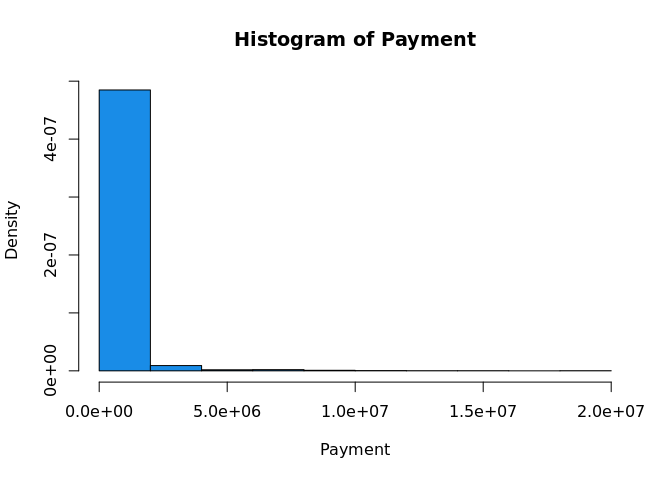
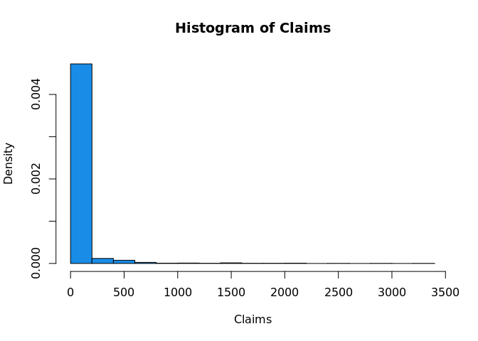
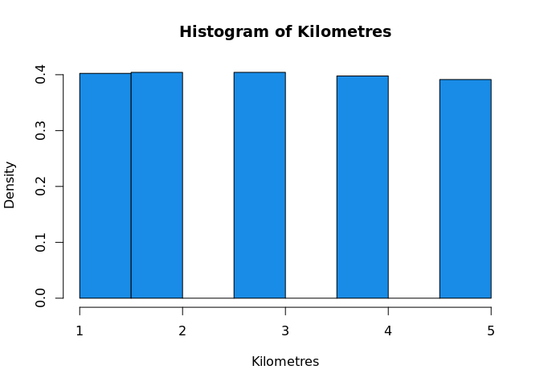
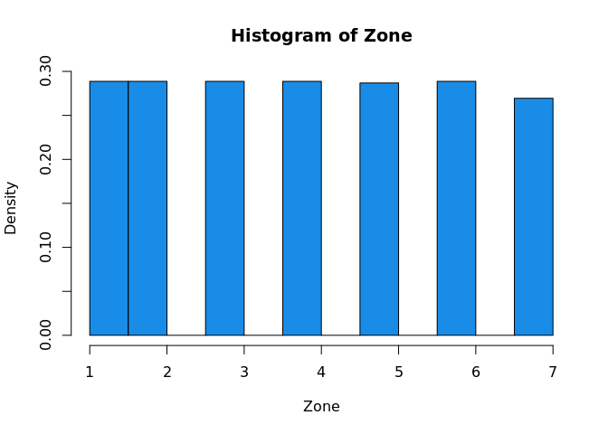
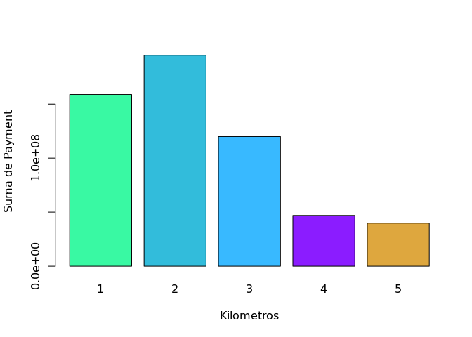
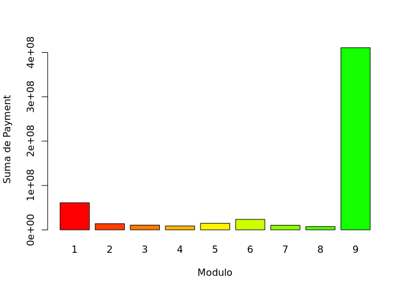
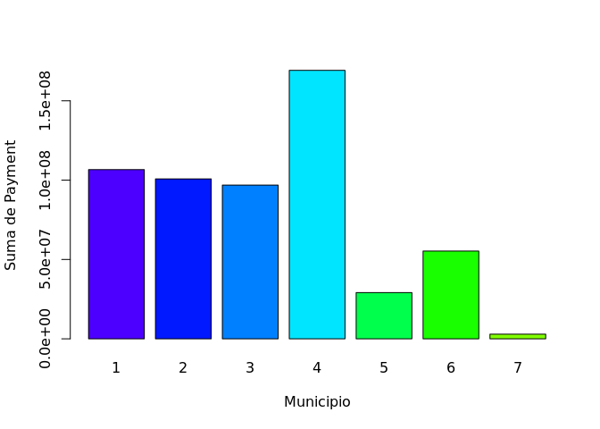
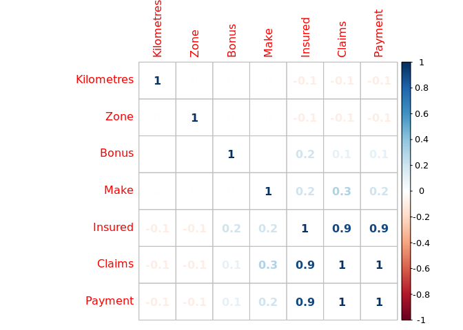
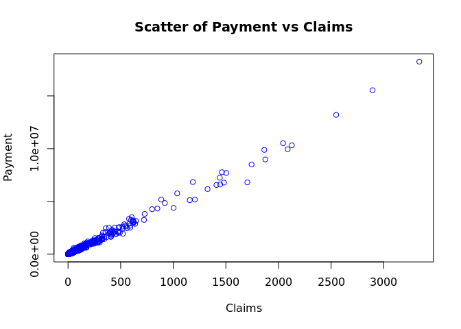
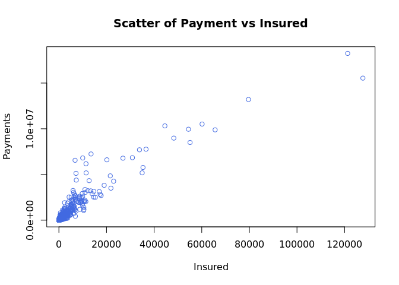

<!-- README.md is generated from README.Rmd. Please edit that file -->

# Insured Analysis

<!-- badges: start -->
<!-- badges: end -->

The goal of Insured\_Analysis is to …

------------------------------------------------------------------------

###### Bussines context

-   The payment variable is a fundamental variable because the committee
    is interested in knowing if this variable is a consequence of the
    number of claims and the number of years on the road.

-   The committee want to find the reasons for which the payment
    increase or decrease.Therefore is necessary check if that is a
    consequence of the variables like location, distance,among others.

-   The committee want to decide whether it should charge especial fees
    depends of factors like location, insured amount, kilometers, bonus,
    etc.

------------------------------------------------------------------------

<!--What is special about using `README.Rmd` instead of just `README.md`? You can include R chunks like so:-->
<!--You'll still need to render `README.Rmd` regularly, to keep `README.md` up-to-date. `devtools::build_readme()` is handy for this. You could also use GitHub Actions to re-render `README.Rmd` every time you push. An example workflow can be found here: <https://github.com/r-lib/actions/tree/master/examples>.-->
<!--You can also embed plots, for example:-->

We look at the dataset and the variables

    #>   Kilometres Zone Bonus Make Insured Claims Payment
    #> 1          1    1     1    1  455.13    108  392491
    #> 2          1    1     1    2   69.17     19   46221
    #> 3          1    1     1    3   72.88     13   15694
    #> 4          1    1     1    4 1292.39    124  422201
    #> 5          1    1     1    5  191.01     40  119373
    #> 6          1    1     1    6  477.66     57  170913

The kilometers variable describes the category of the number of
kilometers driven per insured.

1.  &lt;1,000 km.
2.  1,000 -15,000 km.
3.  15,000 - 20,000 km.
4.  20,000 - 25,000 km.
5.  25,000 km.

The zone variable describes the municipality to which the insured
belongs.

1.  Monterrey.
2.  San Pedro.
3.  San Nicolas.
4.  Escobedo.
5.  Guadalupe.
6.  Garcia.
7.  Others.

Variable Bonus: Number of years since the insured filed a claim +1

Variable Make: Model of the insured car 1-8 represents a certain model
and 9 represents the rest.

Insured variable: Number of insured per policy year.

Claims variable: Number of claims made by the lot or insured.

<!--In that case, don't forget to commit and push the resulting figure files, so they display on GitHub.-->

First We will observe the important variables according to the
committee, where the *payment* and the *claims* variables, are
concentrated, for the most part in the first intervals and for its part
the variables *Zone* and *Kilometers* shape, practically, a uniform
distribution.
<!-- --><!-- --><!-- --><!-- -->

Now, We are going to see the relation between the dependend variable
*Payment* and some other variables that We belive are important like
*Kilometres*, *Zone* and *Make*.

We see that there are many payments between the interval &lt;1,000
Kilometres corresponding to the First Category but there are even more
in the second category 1,000 - 15,000.

<!-- -->

<!-- -->

<!-- -->

We can read these three histograms as a whole, the first histogram of
*Sum of payments* vs *Kilometres* can tell us that in the interval of
1,000 Km to 15,000 Km there will be the maximum of payments.

The second hostogram *Sum Payments* vs *Model* can tell us that our data
about the first eight models does not important because in the model
nine (others models) there are very much payments, so, we can propose,
to expand the models that are observed.

In the last one histogram *Sum of Paymants* vs *Zone*, we can recognize
easily that in the Zone number 4 (Escobedo) there are many payments, so,
these is important if the committee want to make decisions about it that
benefit them.

-   We have to find the correlation for each variable to know wich
    variable have better relation with the variable *Payments*.

<!-- -->

    #> corrplot 0.84 loaded

<!-- -->

We can observe the variable with more relation with *Payments* are
*Insured* and *Claims* with that in mind We will make a scatterplots.

<!-- -->

<!-- -->

<!-- -->
